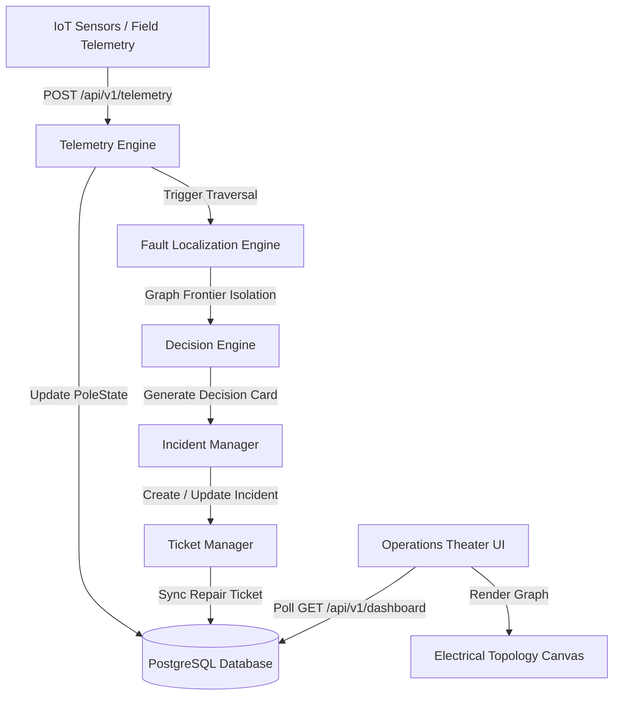

# GRIDASSIST SYSTEM ARCHITECTURE

## High-Level System Diagram

## System Subsystems

1. **Telemetry Engine (`backend/src/services/TelemetryService.ts`):** Validates Zod telemetry payloads, ingests `POWER_LOST` / `POWER_RESTORED` events, and updates `PoleState`.
2. **Fault Localization Engine (`backend/src/localization/LocalizationEngine.ts`):** Traverses radial distribution tree graphs ($T \rightarrow P_{1} \rightarrow P_{2} \dots$) to isolate exact fault frontier spans between live parent nodes and dark child nodes.
3. **Decision Engine (`backend/src/localization/DecisionEngine.ts`):** Generates deterministic Decision Cards detailing observable evidence, confidence scores, and rejected alternative hypotheses.
4. **Incident & Ticket Managers (`backend/src/services/`):** Manages persistent 1-to-1 incident and repair ticket lifecycles, supporting 10-minute reopening windows and telemetry auto-verification.
5. **Operations Theater UI (`frontend/src/`):** Interactive SCADA dashboard featuring an 85%+ viewport HTML5 Canvas topology graph (`ElectricalTopologyCanvas.tsx`), power flow particle physics, and Mission Control HUD (`OperationalNarrationHUD.tsx`).

For complete detailed specifications, see `docs/architecture/` and `docs/algorithms/`.
