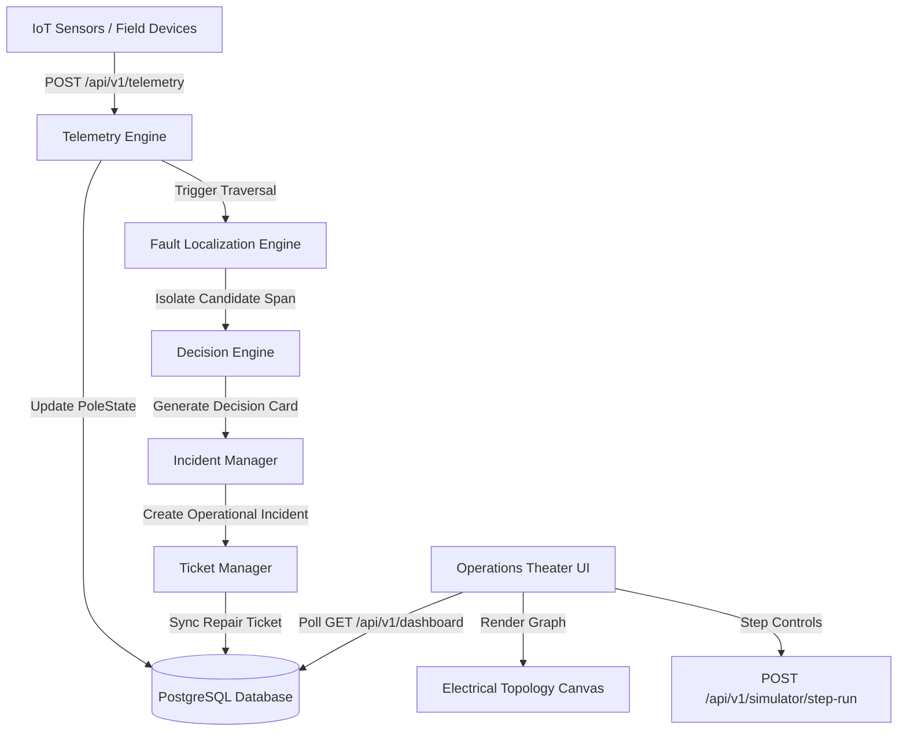

<div align="center">

# ⚡ GridAssist

### AI-Powered Visual Electrical Grid Fault Localization & SCADA Operations Theater

[](https://github.com/sanskaar01/GridAssist)
[](https://www.typescriptlang.org/)
[](https://reactjs.org/)
[](https://www.prisma.io/)
[](LICENSE)

*GridAssist is a mission-critical electrical distribution grid command center that ingests IoT sensor telemetry, traverses radial network trees, and isolates physical line breaks using the **Fault Frontier** principle—visualized live in an interactive SCADA Operations Theater.*

[Documentation](docs/README.md) • [System Architecture](docs/architecture/ARCHITECTURE.md) • [Guided Scenarios](docs/scenarios/ScenarioStoryboards.md) • [Roadmap](ROADMAP.md)

</div>

---

## 🎯 Submission Quality Gates (G1–G6 Compliance)

| Gate | Requirement | Status / Verification Command |
| :--- | :--- | :--- |
| **G1** | **Public GitHub Repository** | `https://github.com/sanskaar01/GridAssist` (Publicly accessible) |
| **G2** | **One-Command Docker Compose** | `git clone https://github.com/sanskaar01/GridAssist && cd GridAssist && docker compose up` |
| **G3** | **Pre-Seeded Synthetic Network** | Auto-seeded on startup with 47-node connected topology (Substation, Feeders, DTs, Poles) |
| **G4** | **Public Production URL** | 🌐 **[https://grid-assist.vercel.app](https://grid-assist.vercel.app)** (No login / No VPN / Free Tier) |
| **G5** | **Runnable Fault Simulator** | Accessible directly in UI via **SCENARIO Selector** or `POST /api/v1/simulator/step-run` |
| **G6** | **Guided Operations Theater Demo** | Interactive Guided Theater mode with full physical causality step controls |

---

## ⚡ Overview

When high-voltage overhead distribution lines break or transformers blow out, electricity utility operators face cascading telemetry outages. GridAssist solves this by providing **deterministic graph fault localization**:

1. **Ingests IoT Telemetry:** Validates real-time `POWER_LOST` and `POWER_RESTORED` telemetry payloads.
2. **Traverses Electrical Topology:** Performs deterministic tree graph traversal ($33\text{kV Substation} \rightarrow \text{Feeder} \rightarrow \text{Transformer} \rightarrow \text{Poles}$).
3. **Isolates Fault Frontier:** Pinpoints exact conductor break spans between live parent nodes and dark child nodes.
4. **Filters Sensor Anomalies:** Identifies hardware dropouts when downstream child poles remain energized, blocking false alarms.
5. **Drives Operations Theater:** Renders dynamic power flow particles, glowing red fault spans, and Mission Control briefings on an 85%+ viewport HTML5 Canvas graph.

---

## 🎨 Operations Theater Showcase

```
                     SUBSTATION 33kV (SUB-01)
                                │
                        FEEDER MAIN (F-07)
                  ┌─────────────┴─────────────┐
                  ▼                           ▼
           DT D-0101 (Yellow Square ■)   DT D-0102
         ┌────────┴────────┐         ┌────────┴────────┐
      Spur A            Spur B    Spur C            Spur D
      ● P-001           ● P-005   ● P-010           ● P-013
      │ (Live Green)    │         │ (Live Green)    │
      ● P-002           ● P-006   ● P-011           ● P-014
      ⚡ [Glowing Red Span P-002 -> P-003]
      ● P-003 (Dark Red)
      │ [Power Flow Particles Halted]
      ● P-004 (Dark Red)
```

- **Power Flow Motion:** Particle spheres (`#6EE7B7`) drift downstream along live lines.
- **Particle Halting:** Particle velocity drops to zero instantly beyond isolated conductor breaks.
- **Fault Frontier Isolation:** Failed overhead spans glow with an animated red polyline (`#EF4444`).
- **Guided Demonstration HUD:** Mission Briefing banner displays telemetry payloads, event details, and algorithmic deductions step-by-step.

---

## 🏗️ System Architecture



---

## 🧠 Core Algorithmic Innovations

### 1. The Fault Frontier Principle
Instead of guessing fault locations probabilistically, GridAssist evaluates radial tree graphs to isolate the **frontier span**:
$$\text{Frontier Span} = \left(P_{\text{parent}}, P_{\text{child}}\right) \quad \text{where} \quad \text{State}(P_{\text{parent}}) = \text{LIVE} \;\land\; \text{State}(P_{\text{child}}) = \text{DARK}$$

### 2. Sensor Anomaly Detection (False Alarm Rejection)
If an IoT telemetry device reports `POWER_LOST` on Pole $P_k$, but all downstream child poles $P_{k+1} \dots P_{k+n}$ remain `LIVE`, GridAssist flags a **Sensor Hardware Error**:
- Power flow particles **continue floating through** the anomaly node.
- Zero incident is created.
- The Decision Engine logs an evidence card explaining why the line fault was rejected.

---

## 🚀 Quick Start Guide

### Prerequisites
- Node.js $\ge 18.0$
- npm $\ge 9.0$
- Docker & Docker Compose (optional)

### 1. Clone & Install
```bash
git clone https://github.com/sanskaar01/GridAssist.git
cd GridAssist

# Install Backend & Frontend Dependencies
cd backend && npm install
cd ../frontend && npm install
```

### 2. Launch Local Development Environment
```bash
# Terminal 1: Launch Backend API Server (Port 3000)
cd backend && npm run dev

# Terminal 2: Launch Operations Theater UI (Port 5173)
cd frontend && npm run dev
```

Open [http://localhost:5173](http://localhost:5173) in your browser to launch the SCADA Operations Theater.

---

## 📚 Technical Documentation Index

| Category | Specification Document | Description |
| :--- | :--- | :--- |
| **System Architecture** | 📄 [ARCHITECTURE.md](docs/architecture/ARCHITECTURE.md) | High-level system design & subsystem flowcharts. |
| **Visual Specifications** | 📄 [VISUAL_LANGUAGE.md](docs/experience/VISUAL_LANGUAGE.md) | SCADA color tokens, node symbols, and visual hierarchy. |
| **Interaction Specs** | 📄 [INTERACTION_MODEL.md](docs/experience/INTERACTION_MODEL.md) | Direct graph manipulation, Guided Mode, and shortcuts. |
| **Scenario Storyboards** | 📄 [SCENARIO_STORYBOARDS.md](docs/experience/SCENARIO_STORYBOARDS.md) | Cinematic visual storyboards for 6 core outage scenarios. |
| **Animation Architecture** | 📄 [ANIMATION_ARCHITECTURE.md](docs/animation/ANIMATION_ARCHITECTURE.md) | Particle motion physics formulas and keyframe curves. |
| **Scenario Runtime** | 📄 [SCENARIO_RUNTIME.md](docs/experience/SCENARIO_RUNTIME.md) | Declarative script engine and synchronous step-run API. |
| **Graph Layout Engine** | 📄 [GRAPH_LAYOUT_ENGINE.md](docs/architecture/GRAPH_LAYOUT_ENGINE.md) | Asymmetric irregular feeder tree coordinate algorithms. |
| **Documentation Catalog** | 📄 [docs/README.md](docs/README.md) | Complete directory index of all technical specs. |

---

## 📜 Engineering Ticket History

GridAssist was developed through a rigorous sequence of engineering milestones:

- 📄 **TICKET-001:** Core Domain Schemas & Telemetry Types
- 📄 **TICKET-002:** Relational Database Schema & Seeding Engine
- 📄 **TICKET-007:** Simulator Engine Infrastructure
- 📄 **TICKET-008:** Operator Control Room Interface
- 📄 **TICKET-009:** Interactive Simulation Engine & API Routes
- 📄 **TICKET-010:** Operations Theater Canvas Redesign
- 📄 **TICKET-011:** Scenario-Specific Visualizations & Particle Flow

---

## 🛠️ Technology Stack

- **Core Engine:** TypeScript 5.6, Node.js 18, Express, Prisma ORM, PostgreSQL.
- **Frontend UI:** React 18, HTML5 2D Canvas Context, TailwindCSS, Lucide Icons, Framer Motion, Zustand.
- **DevOps:** Docker, Docker Compose, GitHub Actions CI/CD.

---

## 📄 License

GridAssist is licensed under the [MIT License](LICENSE).