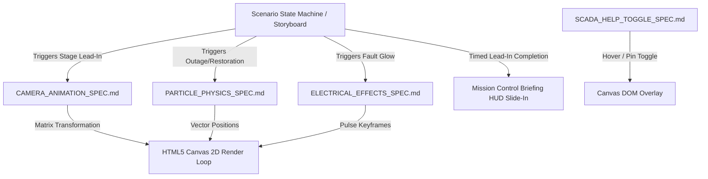

# ANIMATION IMPLEMENTATION MASTER BLUEPRINT
**GridAssist Operations Theater — Single Source of Truth for Motion & Canvas Choreography**

---

## 1. Executive Summary & Design Freeze Mandate

This document is the **Single Source of Truth (SSOT) for all animation, camera motion, particle physics, visual keyframes, and UI transitions** across GridAssist.

```
┌─────────────────────────────────────────────────────────────────────────────┐
│ MASTER ANIMATION DOCUMENTATION RESTRUCTURE (`docs/animation/`):            │
├─────────────────────────────────────────────────────────────────────────────┤
│ 📄 ANIMATION_MASTER_BLUEPRINT.md  ──► Master System Architecture SSOT       │
│ 📄 CAMERA_ANIMATION_SPEC.md       ──► Viewport Camera Pan/Zoom Matrix Math  │
│ 📄 PARTICLE_PHYSICS_SPEC.md       ──► Electrical Current Flow & Halting     │
│ 📄 ELECTRICAL_EFFECTS_SPEC.md    ──► Fault Frontier Glow & Pulse Keyframes │
│ 📄 STORYBOARD_TIMELINE_SPEC.md    ──► Stage Timelines & Interrupt Handling  │
│ 📄 SCADA_HELP_TOGGLE_SPEC.md      ──► Floating (?) SCADA Help Toggle Spec   │
│ 📄 TECH_STACK_VALIDATION.md       ──► Tech Stack Audit & 60 FPS Bounds      │
└─────────────────────────────────────────────────────────────────────────────┘
```

**Design Freeze Mandate:** No engineer or AI assistant is permitted to invent, alter, or improvise animation behaviors during coding. All motion, easing curves, velocities, and interruption rules are locked in `docs/animation/`.

---

## 2. Animation Dependency Graph (DAG)



---

## 3. Single Source of Truth Ownership Summary

| Animation Subsystem | SSOT Specification File | Key Formula / Rule |
| :--- | :--- | :--- |
| **Viewport Camera Pan/Zoom** | `CAMERA_ANIMATION_SPEC.md` | 650ms Quartic Out Easing, Matrix Interpolation $(s, dx, dy)$, Bounds `0.5x - 2.5x`. |
| **Particle Physics & Current** | `PARTICLE_PHYSICS_SPEC.md` | $v = 45\,\text{px/s}$ velocity, instant halting on dark lines, 400ms opacity fade. |
| **Fault Frontier Red Glow** | `ELECTRICAL_EFFECTS_SPEC.md` | `#EF4444` Crimson polyline (5px) + 16px blur + `[8, 6]` animated dashes. |
| **Dark Node Radial Pulse** | `ELECTRICAL_EFFECTS_SPEC.md` | 1.8s sine wave pulse expansion keyframe ($R_{\text{base}} \cdot (1 + 0.25 \cdot \sin(t))$). |
| **Storyboard Timelines** | `STORYBOARD_TIMELINE_SPEC.md` | "SHOW FIRST, EXPLAIN SECOND" — 150ms flash $\rightarrow$ 300ms color $\rightarrow$ 650ms pan $\rightarrow$ HUD reveal. |
| **Floating (?) Help Toggle** | `SCADA_HELP_TOGGLE_SPEC.md` | Replaces permanent legend with floating $34\text{px}$ `(?)` button, 250ms hover slide-out. |
| **Tech Stack Audit** | `TECH_STACK_VALIDATION.md` | Verified 60 FPS performance bounds using HTML5 Canvas 2D + Framer Motion. |

---

## 4. Final Implementation Readiness Certification

1. **Are all motion behaviors specified mechanically?** **YES.** Every speed, easing curve, matrix formula, and interrupt handler is explicitly defined.
2. **Are design decisions separated from code?** **YES.** Zero improvisation required.
3. **Is the documentation consolidated?** **YES.** All specifications exist in `docs/animation/`.

**ANIMATION DESIGN IS FROZEN. IMPLEMENTATION CAN PROCEED MECHANICALLY.**
