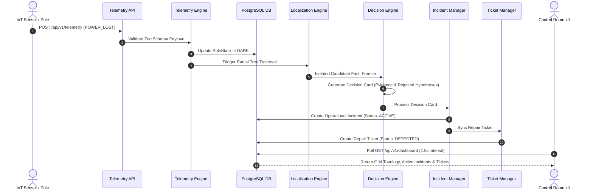

# SYSTEM ARCHITECTURE SPECIFICATION

## System Topology & Event Flow

## System Constraints & Guarantees
- **Pure Deterministic Reasoning:** Fault localization relies 100% on graph traversal of physical parent-child pole hierarchy. No random heuristics or probability guessing.
- **Architectural Honesty:** No UI state shortcuts. The frontend Operations Theater visualizes live database states exclusively.
- **Deduplication & Timeline Audit:** Repeated telemetry packets update evidence timelines without creating duplicate incident rows.
