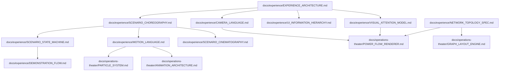

# DOCUMENTATION DEPENDENCY GRAPH
**GridAssist Operations Theater — Documentation Architecture & Cross-References**

---

## 1. Documentation Dependency Graph

The technical specifications form a directed acyclic graph (DAG) where higher-level Experience Architecture documents drive lower-level Implementation Specifications.

---

## 2. Document Cross-Reference Map

| Document | Direct Dependencies (Imports) | Dependent Documents (Export Consumers) |
| :--- | :--- | :--- |
| **`EXPERIENCE_ARCHITECTURE.md`** | None (Root Specification) | `SCENARIO_CHOREOGRAPHY.md`, `CAMERA_LANGUAGE.md`, `UI_INFORMATION_HIERARCHY.md` |
| **`SCENARIO_CHOREOGRAPHY.md`** | `EXPERIENCE_ARCHITECTURE.md` | `SCENARIO_STATE_MACHINE.md`, `DEMONSTRATION_FLOW.md`, `SCENARIO_CINEMATOGRAPHY.md` |
| **`CAMERA_LANGUAGE.md`** | `EXPERIENCE_ARCHITECTURE.md` | `SCENARIO_CINEMATOGRAPHY.md`, `POWER_FLOW_RENDERER.md` |
| **`MOTION_LANGUAGE.md`** | `EXPERIENCE_ARCHITECTURE.md` | `PARTICLE_SYSTEM.md`, `ANIMATION_ARCHITECTURE.md` |
| **`NETWORK_TOPOLOGY_SPEC.md`** | `SystemArchitecture.md` | `GRAPH_LAYOUT_ENGINE.md`, `POWER_FLOW_RENDERER.md` |
| **`UI_INFORMATION_HIERARCHY.md`** | `EXPERIENCE_ARCHITECTURE.md` | `DEMONSTRATION_FLOW.md`, `VisualLanguage.md` |
