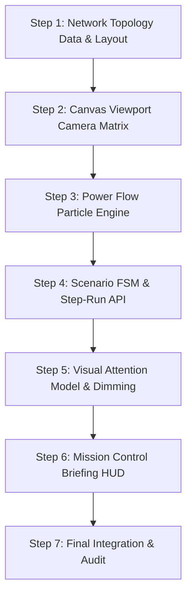

# IMPLEMENTATION SEQUENCE & OPEN DOCUMENT MATRIX
**GridAssist Operations Theater — Implementation Readiness Certification**

---

## 1. Executive Summary & Mechanical Translation Strategy

Implementation Phase 2 translates locked design specifications into TypeScript code without making any design decisions during coding.

To enforce this, every engineering task is assigned:
1. **Exact Subsystem Implementation Order** (Dependencies must be built strictly bottom-up).
2. **Open Document Matrix** (The exact 2 to 3 specification files that engineers MUST keep open simultaneously while implementing).

---

## 2. Master Subsystem Implementation Sequence

---

## 3. Step-by-Step Implementation & Open Document Matrix

### Step 1: Network Topology Data & Asymmetric Layout
- **Goal:** Expand seed database and front-end dataset to 47 connected nodes ($33\text{kV Substation} \rightarrow \text{Feeder F-07} \rightarrow \text{DT D-0101} \dots$) with irregular horizontal skews.
- **Required Open Documents:**
  1. 📄 `docs/experience/NETWORK_TOPOLOGY_SPEC.md` (SSOT for 47-node coordinates and tree branches)
  2. 📄 `docs/operations-theater/GRAPH_LAYOUT_ENGINE.md` (Asymmetric positioning formulas)

### Step 2: Canvas Viewport Camera Matrix & Zoom Bounds
- **Goal:** Implement 2D transformation matrix ($s, dx, dy$), auto-focus centroid centering, mouse wheel zoom bounds ($0.5\times \dots 2.5\times$), and quartic easing curves.
- **Required Open Documents:**
  1. 📄 `docs/experience/CAMERA_LANGUAGE.md` (SSOT for matrix math & zoom limits)
  2. 📄 `docs/experience/SCENARIO_CINEMATOGRAPHY.md` (Shot framing composition presets)

### Step 3: Power Flow Particle Engine & Halting Physics
- **Goal:** Render 2D canvas particle current flows ($v = 45\,\text{px/s}$) and instant halting on de-energized/fault frontier line spans.
- **Required Open Documents:**
  1. 📄 `docs/experience/MOTION_LANGUAGE.md` (SSOT for physical velocity & halting rules)
  2. 📄 `docs/operations-theater/POWER_FLOW_RENDERER.md` (Canvas drawing path logic)
  3. 📄 `docs/operations-theater/PARTICLE_SYSTEM.md` (Sensor anomaly particle flow override)

### Step 4: Scenario Finite State Machine & Step-Run Synchronous API
- **Goal:** Wire `POST /api/v1/simulator/step-run` API with Zustand simulation store (`useSimulationStore.ts`) and FSM state contracts (`IDLE` $\rightarrow$ `STAGE_LEAD_IN` $\rightarrow$ `TELEMETRY_INGESTION` $\dots$).
- **Required Open Documents:**
  1. 📄 `docs/experience/SCENARIO_STATE_MACHINE.md` (SSOT for FSM transitions)
  2. 📄 `docs/scenarios/SCENARIO_RUNTIME.md` (Declarative script schema)

### Step 5: Visual Attention Model & Selective Dimming
- **Goal:** Apply selective opacity dimming (100% opacity on active branch, 15% opacity on unrelated branches).
- **Required Open Documents:**
  1. 📄 `docs/experience/VISUAL_ATTENTION_MODEL.md` (SSOT for opacity constants)
  2. 📄 `docs/experience/TRANSITION_GUIDELINES.md` (Timing & easing curves)

### Step 6: Mission Control Briefing HUD & Decluttered Chrome
- **Goal:** Implement `OperationalNarrationHUD.tsx` with Framer Motion slide-in briefings and move SCADA legend to floating `?` button.
- **Required Open Documents:**
  1. 📄 `docs/experience/UI_INFORMATION_HIERARCHY.md` (SSOT for 85%+ viewport allocation)
  2. 📄 `docs/experience/DEMONSTRATION_FLOW.md` (Guided step control pipeline)

### Step 7: Final Integration & Audit
- **Goal:** Run end-to-end verification across all 6 scenarios.
- **Required Open Documents:**
  1. 📄 `docs/experience/90_SECOND_DEMO_SCRIPT.md` (Evaluator experience timeline)
