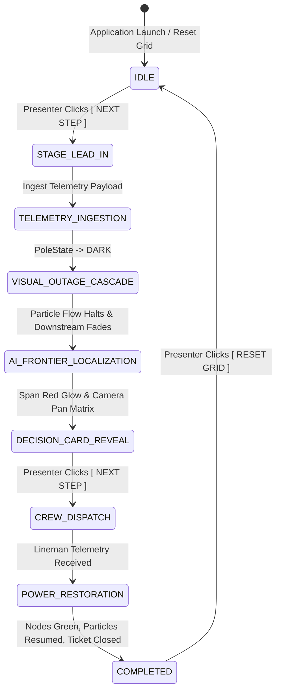

# SCENARIO STATE MACHINE SPECIFICATION
**GridAssist Operations Theater — Simulation Finite State Machine**

---

## 1. Scenario FSM State Diagram

---

## 2. FSM State Transition Contracts

| Current FSM State | Trigger Event | Next FSM State | Visual & Audio Output | UI Control State |
| :--- | :--- | :--- | :--- | :--- |
| **`IDLE`** | Presenter Clicks `[ NEXT STEP ]` | **`STAGE_LEAD_IN`** | Grid baseline flow, Camera 1.0x | `[ NEXT STEP ]` Active |
| **`STAGE_LEAD_IN`** | Lead-in timer completes (150ms) | **`TELEMETRY_INGESTION`** | Node flashes amber once | HUD Slides Down |
| **`TELEMETRY_INGESTION`** | Telemetry ingestion completes | **`VISUAL_OUTAGE_CASCADE`** | Nodes turn dark red, particles halt | HUD displays payload |
| **`VISUAL_OUTAGE_CASCADE`** | Cascade animation ends (400ms) | **`AI_FRONTIER_LOCALIZATION`** | Camera auto-pans to span | HUD updates |
| **`AI_FRONTIER_LOCALIZATION`**| Span glow animation ends (500ms) | **`DECISION_CARD_REVEAL`** | Failed span glows red, decision card slides out | Glow `[ NEXT STEP ]` |
| **`DECISION_CARD_REVEAL`** | Presenter Clicks `[ NEXT STEP ]` | **`CREW_DISPATCH`** | Crew marker moves along feeder line | Ticket -> IN_PROGRESS |
| **`CREW_DISPATCH`** | Restoration telemetry arrives | **`POWER_RESTORATION`** | Nodes turn green sequentially | Ticket -> VERIFIED |
| **`POWER_RESTORATION`** | Particles resume flowing | **`COMPLETED`** | Red span glow fades, ticket CLOSED | Briefing -> Finished |
